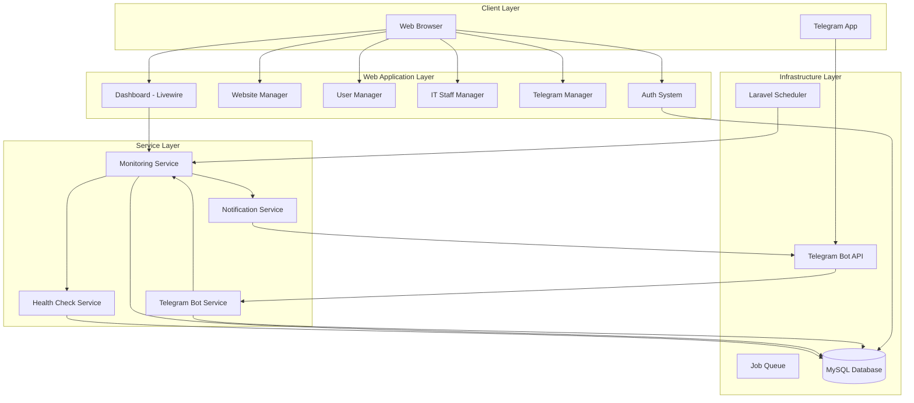
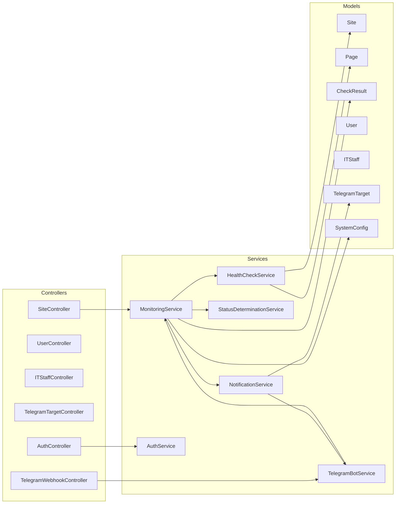
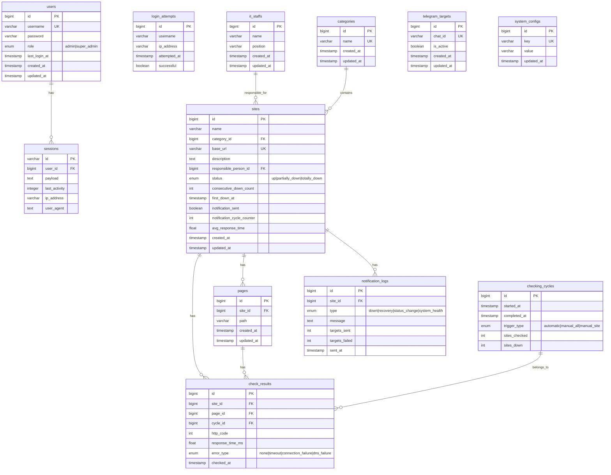

# Design Document: Webstatus-V2

## Overview

Webstatus-V2 is a website monitoring system for Institut Teknologi Kalimantan (ITK) that performs automated HTTP health checks on institutional websites at configurable intervals. The system determines availability status (up, partially_down, totally_down), displays real-time monitoring data on a web dashboard, and sends Telegram notifications to IT staff when outages are detected.

### Key Design Goals

- **Reliability**: The monitoring service runs continuously in the background, independent of user sessions, with state persisted to survive restarts
- **Low Latency Detection**: All HTTP checks for a cycle complete within 10 seconds using concurrent requests
- **False Positive Prevention**: Notifications are only sent after 3 consecutive down cycles to filter transient issues
- **Role-Based Access**: Admin and Super_Admin roles with clearly separated permissions
- **Real-Time Dashboard**: Live countdown timer, status updates within 2 seconds of cycle completion

### Technology Stack

| Layer | Technology | Rationale |
|-------|-----------|-----------|
| Backend | Laravel 13 (PHP 8.3+) | Project runs on Laragon; Laravel 13 is the latest stable release with improved performance, scheduling, queues, HTTP client, and robust ORM |
| Frontend | Blade + Livewire + Alpine.js | Server-rendered with real-time reactivity; simpler than SPA for this use case |
| CSS | Tailwind CSS v4 | Rapid UI development with ITK brand color customization, responsive utilities |
| Database | MySQL 8.0 | Available in Laragon, handles relational data well |
| HTTP Client | Laravel HTTP Client (Guzzle) | Concurrent async requests with timeout support |
| Background Jobs | Laravel Scheduler + Queue (database driver) | Reliable cycle execution without external dependencies |
| Telegram | Telegram Bot API via HTTP | Direct API calls for notifications and command handling |
| Charts | Chart.js | Lightweight charting for response time and downtime graphs |
| Select UI | Tom Select | Searchable dropdown for site filtering (60+ sites) |
| Real-time Updates | Livewire polling (2s interval) | Simple polling for dashboard updates without WebSocket complexity |

## UI Design System

### Font

- **Font Family**: Figtree (Google Font, already bundled with Laravel 13)
- **Weights**: 300 (Light), 400 (Regular), 500 (Medium), 600 (SemiBold), 700 (Bold)

### Color Palette (based on ITK brand identity)

The color system uses these scales (50–900 shades):

| Role | Base Color | Usage |
|------|-----------|-------|
| Primary (Blue) | #1565C0 (blue-700) | Main brand color, navigation bar, headers, primary buttons, links |
| Secondary (Gold) | #F5A623 | Accent color, highlights, secondary actions, ITK logo gold |
| Dark | #1A1A2E | Text, dark backgrounds |
| Gray | #6B7280 | Borders, disabled states, secondary text |
| Red | #DC2626 | "totally_down" status, error states, destructive actions |
| Yellow | #F59E0B | "partially_down" status, warnings |
| Green | #16A34A | "up" status, success states |
| Info (Cyan) | #06B6D4 | Informational badges, secondary highlights |
| Light | #F8FAFC | Page backgrounds, card backgrounds |

### Status Colors (Critical for Dashboard)

| Status | Color | Badge Style |
|--------|-------|------------|
| Up | Green (#16A34A) | Green background with white text |
| Partially Down | Yellow (#F59E0B) | Yellow/amber background with dark text |
| Totally Down | Red (#DC2626) | Red background with white text |

### Layout Style (based on ITK website references)

- **Navigation**: Solid blue (#1565C0) top navigation bar with white text, ITK logo on the left
- **Page Headers**: Blue gradient banner sections for page titles (similar to "Rilis Berita", "Profil Dosen" headers in references)
- **Content Area**: White background with subtle gray borders for cards
- **Cards**: White background, rounded corners (8px), subtle shadow, clean spacing
- **Footer**: Dark blue background with white text, ITK logo centered
- **Sidebar**: Left sidebar navigation for admin sections (Website Manager, User Manager, etc.)

### Responsive Breakpoints

| Breakpoint | Width | Layout |
|-----------|-------|--------|
| Mobile | < 640px | Single column, hamburger menu, stacked cards |
| Tablet | 640px – 1024px | 2-column grid, collapsible sidebar |
| Desktop | 1024px – 1920px | Full sidebar, multi-column card grid (up to 12 cards per row at 1920px) |
| Wide | > 1920px | Max-width container centered |

### Component Style Guidelines

- **Buttons**: Rounded (border-radius: 6px), primary blue for main actions, outlined for secondary
- **Tables**: Striped rows, hover state, responsive (horizontal scroll on mobile)
- **Forms**: Floating labels or top-aligned labels, blue focus ring
- **Modals**: Centered overlay, white card with rounded corners
- **Graphs/Charts**: Use primary blue and secondary gold as main chart colors, gray gridlines

### Branding

- ITK logo (Logo_ITK.webp) displayed in navigation bar and login page
- Logo colors: Blue (#4A90D9 light blue) and Gold (#F5A623)

### Deployment

- Local development on Laragon (Windows) — cycle runs via Livewire poll fallback or `schedule:daemon`
- Production-ready for Linux VPS with cron, queue worker, and Telegram webhook
- Telegram bot token provided via .env file
- Minimum server specs for production: 1 vCPU, 1GB RAM, PHP 8.2+, Nginx

## Architecture

### High-Level Architecture



### Monitoring Cycle Flow

```mermaid
sequenceDiagram
    participant Scheduler
    participant MonitoringService
    participant HealthCheckService
    participant Sites as Monitored Sites
    participant DB as Database
    participant NotificationService
    participant Telegram

    Scheduler->>MonitoringService: triggerCycle()
    MonitoringService->>DB: Get all sites with pages
    MonitoringService->>HealthCheckService: checkAllSites(sites)
    
    par Concurrent HTTP checks
        HealthCheckService->>Sites: HTTP GET /page1
        HealthCheckService->>Sites: HTTP GET /page2
        HealthCheckService->>Sites: HTTP GET /pageN
    end

    HealthCheckService-->>MonitoringService: CheckResults[]
    MonitoringService->>MonitoringService: determineStatus(results)
    MonitoringService->>DB: persistResults(results)
    MonitoringService->>DB: updateConsecutiveDownCounts()
    
    MonitoringService->>NotificationService: evaluateNotifications(sites)
    
    alt consecutiveDown >= 3 AND not yet notified
        NotificationService->>Telegram: sendDownNotification()
    end
    
    alt site recovered AND was notified
        NotificationService->>Telegram: sendRecoveryNotification()
    end

    MonitoringService->>DB: updateCycleTimestamp()
</sequenceDiagram>
```

### Deployment Architecture

The system runs as a single Laravel application with two deployment modes:

**Production (Linux server):**
- **Cron Job**: `* * * * * php artisan schedule:run` — triggers cycle at configured interval
- **Queue Worker**: `php artisan queue:work` as a systemd service — processes notification jobs
- **Telegram Webhook**: Receives bot commands via HTTPS webhook endpoint

**Local Development (Windows/Laragon):**
- **Livewire Poll Fallback**: The dashboard's 2-second polling auto-triggers the cycle via `popen` when countdown expires (no cron needed)
- **Scheduler Daemon**: Alternative via `php artisan schedule:daemon` (loops every 60s)
- **Telegram Long Polling**: `php artisan telegram:poll` for local bot testing without webhook

## Components and Interfaces

### 1. Monitoring Service (`App\Services\MonitoringService`)

Orchestrates the checking cycle, coordinates health checks, determines status, and triggers notifications.

```php
interface MonitoringServiceInterface
{
    /** Execute a full checking cycle for all sites */
    public function executeCycle(): CycleResult;
    
    /** Execute checks for a single site */
    public function refreshSite(int $siteId): SiteCheckResult;
    
    /** Get current cycle state (countdown, last check, etc.) */
    public function getCycleState(): CycleState;
    
    /** Check if a cycle is currently running */
    public function isCycleInProgress(): bool;
    
    /** Get configured cycle interval in minutes */
    public function getCycleInterval(): int;
    
    /** Update cycle interval (Super_Admin only) */
    public function setCycleInterval(int $minutes): void;
}
```

### 2. Health Check Service (`App\Services\HealthCheckService`)

Executes concurrent HTTP requests to all site pages and returns raw results.

```php
interface HealthCheckServiceInterface
{
    /** Check all pages of all provided sites concurrently */
    public function checkAllSites(Collection $sites): Collection;
    
    /** Check all pages of a single site */
    public function checkSite(Site $site): SiteCheckResult;
}
```

**Implementation Notes:**
- Uses Laravel HTTP Client pool for concurrent requests
- Connection timeout: configurable via `system_configs.connection_timeout_seconds` (default 20s)
- Response timeout: configurable via `system_configs.response_timeout_seconds` (default 50s)
- Concurrency limit: configurable via `system_configs.concurrency_limit` (default 50)
- Processes requests in batches of the concurrency limit to avoid overwhelming OS connections and DNS
- Writes live log entries to cache (`monitoring_cycle_live_log`) as each page is checked, enabling real-time progress visibility in the dashboard
- SSL verification is disabled (`'verify' => false`) to allow monitoring sites with invalid/self-signed certificates

### 3. Status Determination Service (`App\Services\StatusDeterminationService`)

Pure logic service that determines site status from page check results.

```php
interface StatusDeterminationServiceInterface
{
    /** Determine site availability status from page results */
    public function determineStatus(Site $site, Collection $pageResults): SiteStatus;
    
    /** Calculate average response time for reachable pages */
    public function calculateAverageResponseTime(Collection $pageResults): float;
}
```

**Status Rules:**
- `up`: All pages return 2xx or 3xx
- `partially_down`: Some pages fail, some succeed
- `totally_down`: All pages fail or are unreachable
- No pages defined: defaults to `up`

### 4. Notification Service (`App\Services\NotificationService`)

Evaluates notification conditions and dispatches Telegram messages.

```php
interface NotificationServiceInterface
{
    /** Evaluate all sites and send notifications as needed */
    public function evaluateAndNotify(Collection $siteResults): void;
    
    /** Send a down notification for a specific site */
    public function sendDownNotification(Site $site, string $status, array $downPages): void;
    
    /** Send a recovery notification for a specific site */
    public function sendRecoveryNotification(Site $site, string $downDuration): void;
    
    /** Get configured notification cycle threshold */
    public function getNotificationCycleThreshold(): int;
    
    /** Set notification cycle threshold */
    public function setNotificationCycleThreshold(int $cycles): void;
}
```

**Notification Logic:**
- False positive threshold: 3 consecutive down cycles
- Repeat notification interval: configurable (default 6 cycles)
- Retry on failure: 3 attempts, 5-second intervals
- Recovery notification: only if down notification was previously sent
- **Consolidated down messages**: Instead of per-site notifications, the system queries ALL currently down sites and sends a single message listing all of them in a numbered table format (name, base URL, down since)
- **No page-level detail**: Down notifications only include the site base URL, not individual page paths
- **Accumulative**: If site A is down and site B goes down later, the next notification includes both A and B

### 5. Telegram Bot Service (`App\Services\TelegramBotService`)

Handles incoming Telegram commands and formats responses.

```php
interface TelegramBotServiceInterface
{
    /** Process an incoming webhook update */
    public function handleUpdate(array $update): void;
    
    /** Send a message to a specific chat_id */
    public function sendMessage(string $chatId, string $message): bool;
    
    /** Send a message to all active targets */
    public function broadcastToActiveTargets(string $message): void;
}
```

**Supported Commands:**
| Command | Description |
|---------|-------------|
| `/start` | Welcome message with bot description and command list |
| `/help` | List all available commands with descriptions |
| `/chat_id` | Returns the user's Telegram chat_id |
| `/recepient` | Self-register as notification recipient |
| `/subscribe` | Activate notifications (set is_active = 1) |
| `/unsubscribe` | Deactivate notifications (set is_active = 0) |
| `/down` | List currently down sites |
| `/refresh` | Trigger manual refresh cycle |

### 6. Authentication Service (`App\Services\AuthService`)

Manages user sessions, password hashing, and login rate limiting.

```php
interface AuthServiceInterface
{
    /** Authenticate user credentials */
    public function authenticate(string $username, string $password): ?User;
    
    /** Check if account is locked */
    public function isAccountLocked(string $username): bool;
    
    /** Record a failed login attempt */
    public function recordFailedAttempt(string $username): void;
    
    /** Change user password */
    public function changePassword(User $user, string $currentPassword, string $newPassword): bool;
    
    /** Invalidate all sessions for a user except current */
    public function invalidateOtherSessions(User $user): void;
}
```

### 7. Dashboard Component (`App\Livewire\Dashboard`)

Livewire component providing real-time dashboard with polling.

```php
// Livewire component with 2-second polling
class Dashboard extends Component
{
    public function mount(): void;          // Load initial state
    public function poll(): void;           // 2s polling: update UI state, auto-trigger cycle when countdown expires
    public function refreshAll(): void;     // Trigger manual refresh (async via background process)
    public function refreshSite(int $id): void;  // Trigger single site refresh (synchronous)
    public function toggleLogDrawer(): void; // Toggle live log side drawer
    public function render(): View;         // Render dashboard view
}
```

**Key Behaviors:**
- `refreshAll()` spawns the monitoring cycle as a background process via `popen` (non-blocking) — the UI returns immediately and updates when the cycle completes
- `poll()` detects cycle completion by watching `lastCycleDatetime` changes, resets `isRefreshing` flag, and pushes updated chart data
- Auto-trigger logic in `poll()` spawns the cycle via `popen` when countdown reaches 0 (fallback for environments without cron)
- Live log drawer reads from cache (`monitoring_cycle_live_log`) during polling, showing real-time progress with site name, page URL, HTTP code, and response time
- Overview charts use Tom Select for searchable site filtering

### Component Interaction Diagram



## Data Models

### Entity Relationship Diagram



### Key Model Definitions

#### Site Model
```php
class Site extends Model
{
    protected $fillable = [
        'name', 'category_id', 'base_url', 'description',
        'responsible_person_id', 'status', 'consecutive_down_count',
        'first_down_at', 'notification_sent', 'notification_cycle_counter',
        'avg_response_time'
    ];

    protected $casts = [
        'status' => SiteStatus::class,  // Enum: up, partially_down, totally_down
        'first_down_at' => 'datetime',
        'notification_sent' => 'boolean',
    ];

    public function pages(): HasMany;
    public function category(): BelongsTo;
    public function responsiblePerson(): BelongsTo;
    public function checkResults(): HasMany;
}
```

#### CheckResult Model
```php
class CheckResult extends Model
{
    protected $fillable = [
        'site_id', 'page_id', 'cycle_id', 'http_code',
        'response_time_ms', 'error_type', 'checked_at'
    ];

    protected $casts = [
        'error_type' => ErrorType::class,  // Enum: none, timeout, connection_failure, dns_failure
        'checked_at' => 'datetime',
    ];
}
```

#### System Configuration Keys
| Key | Default | Description |
|-----|---------|-------------|
| `cycle_interval_minutes` | 10 | Minutes between checking cycles |
| `notification_cycle_threshold` | 6 | Cycles between repeated notifications |
| `false_positive_threshold` | 3 | Consecutive down cycles before notification |
| `session_timeout_minutes` | 30 | Session inactivity timeout |
| `connection_timeout_seconds` | 20 | Max seconds to establish TCP connection per request |
| `response_timeout_seconds` | 50 | Max seconds to wait for HTTP response after connecting |
| `concurrency_limit` | 50 | Max simultaneous HTTP requests per batch (range: 5–100) |
| `last_cycle_completed_at` | null | Timestamp of last successful cycle completion |
| `last_cycle_run_at` | null | Timestamp synced with scheduler to prevent double-triggering |
| `consecutive_cycle_failures` | 0 | Counter for consecutive cycle crashes; triggers system health alert at 3 |


## Correctness Properties

*A property is a characteristic or behavior that should hold true across all valid executions of a system — essentially, a formal statement about what the system should do. Properties serve as the bridge between human-readable specifications and machine-verifiable correctness guarantees.*

### Property 1: Site status determination is correct for any combination of page results

*For any* site with N defined pages (N ≥ 0) and any combination of HTTP response results per page, the `determineStatus` function SHALL return:
- `"up"` when all pages return 2xx or 3xx status codes
- `"partially_down"` when some but not all pages return non-2xx/3xx or are unreachable
- `"totally_down"` when all pages return non-2xx/3xx or are unreachable
- `"up"` when the site has zero defined pages

**Validates: Requirements 3.1, 3.2, 3.3, 3.4**

### Property 2: Consecutive down count follows increment/reset rules

*For any* sequence of checking cycle results for a site, the consecutive_down_count SHALL increment by exactly 1 when the cycle result is "partially_down" or "totally_down", and SHALL reset to exactly 0 when the cycle result is "up".

**Validates: Requirements 3.6**

### Property 3: Cycle interval validation accepts only values in [5, 1440]

*For any* integer value submitted as a cycle interval, the system SHALL accept it if and only if the value is in the range [5, 1440] inclusive. All values outside this range SHALL be rejected.

**Validates: Requirements 1.4, 24.2**

### Property 4: Notification cycle threshold validation accepts only whole numbers in [1, 100]

*For any* value submitted as a notification cycle threshold, the system SHALL accept it if and only if it is a whole number in the range [1, 100] inclusive. Non-integer values and values outside this range SHALL be rejected.

**Validates: Requirements 25.2, 25.3**

### Property 5: Average response time calculation

*For any* set of page check results for a site, the calculated average response time SHALL equal the sum of response times of all reachable pages divided by the count of reachable pages. If all pages are unreachable (count of reachable pages is 0), the average SHALL be exactly 0.

**Validates: Requirements 2.5, 2.6**

### Property 6: Down notification is sent if and only if consecutive down count reaches threshold

*For any* site, a down notification SHALL be sent when consecutive_down_count reaches exactly the False_Positive_Threshold (3) for the first time during an outage. For any consecutive_down_count less than 3, no down notification SHALL be sent.

**Validates: Requirements 13.1, 13.2**

### Property 7: Repeated down notifications occur at exact multiples of the configured threshold

*For any* site that remains down after the initial notification, repeated notifications SHALL be sent at cycle counts that are exact multiples of the Notification_Cycle_Threshold counting from the initial notification cycle. No repeated notification SHALL be sent at any other cycle count.

**Validates: Requirements 13.4, 13.5**

### Property 8: Status change between down states triggers updated notification

*For any* site with consecutive_down_count at or above the False_Positive_Threshold, if the status changes between "partially_down" and "totally_down", an updated notification SHALL be sent. No notification SHALL be sent if the status remains the same.

**Validates: Requirements 13.6**

### Property 9: Recovery notification conditions

*For any* site that transitions from "totally_down" or "partially_down" to "up":
- A recovery notification SHALL be sent if and only if a down notification was previously sent (notification_sent = true)
- No recovery notification SHALL be sent if the site recovered before reaching the False_Positive_Threshold
- No recovery notification SHALL be sent when transitioning from "totally_down" to "partially_down" (both are still down states)

**Validates: Requirements 14.1, 14.3, 14.5**

### Property 10: URL format validation

*For any* string submitted as a site base URL, the system SHALL accept it if and only if it begins with "http://" or "https://". All other strings SHALL be rejected.

**Validates: Requirements 9.7**

### Property 11: Page path validation

*For any* string submitted as a page path, the system SHALL accept it if and only if it starts with "/". All other strings SHALL be rejected.

**Validates: Requirements 9.8**

### Property 12: Dashboard site list sort order

*For any* list of monitored sites, the sorted display order SHALL place all "totally_down" sites first, then all "partially_down" sites, then all "up" sites. Within each status group, sites SHALL be sorted alphabetically by name. This invariant must hold regardless of the number or mix of sites.

**Validates: Requirements 7.5**

### Property 13: Role-based access control enforcement

*For any* combination of user role and protected resource, the Auth_System SHALL grant access if and only if the role-resource pair exists in the permission matrix (Admin: Dashboard, Website_Manager, profile; Super_Admin: all resources). All other combinations SHALL be denied.

**Validates: Requirements 22.1, 22.2, 22.3**

### Property 14: Fault isolation during checking cycles

*For any* set of monitored sites where some HTTP checks fail (timeout, connection error, DNS failure), all remaining sites in the cycle SHALL still be processed and their results recorded. The number of processed sites SHALL always equal the total number of monitored sites.

**Validates: Requirements 1.8**

### Property 15: Subscribe/unsubscribe round trip

*For any* registered Telegram target, executing subscribe followed by unsubscribe SHALL result in is_active = 0, and executing unsubscribe followed by subscribe SHALL result in is_active = 1. The operations are inverses of each other.

**Validates: Requirements 18.1, 18.4**

## Error Handling

### HTTP Check Errors

| Error Type | Handling Strategy |
|-----------|------------------|
| Connection timeout | Record page as unreachable, error_type = `connection_failure`, http_code = 0. Timeout is configurable via `connection_timeout_seconds` (default 20s) |
| Response timeout | Record page as unreachable, error_type = `timeout`, http_code = 0. Timeout is configurable via `response_timeout_seconds` (default 50s) |
| DNS resolution failure | Record page as unreachable, error_type = `dns_failure`, http_code = 0 |
| SSL/TLS error | Record page as unreachable, error_type = `connection_failure`, http_code = 0 (SSL verify disabled, so this only occurs on fundamental TLS failures) |

### Notification Delivery Errors

| Error Scenario | Handling Strategy |
|---------------|------------------|
| Telegram API unreachable | Retry 3 times with 5-second intervals, then skip target for this cycle |
| Invalid chat_id | Log error, skip target, continue with other targets |
| Rate limited by Telegram | Implement exponential backoff, retry on next cycle |
| Message too long (>4096 chars) | Split message into multiple sends |

### Authentication Errors

| Error Scenario | Handling Strategy |
|---------------|------------------|
| Invalid credentials | Generic "Login failed" message (no field-specific hints) |
| Account locked (5 failures in 15 min) | Display lockout message with remaining time |
| Session expired | Redirect to login with "Session expired" message |
| Insufficient permissions | Redirect to dashboard with "Unauthorized" message |

### System Recovery

| Error Scenario | Handling Strategy |
|---------------|------------------|
| Cycle fails to complete | Log error with timestamp and cycle ID, retry next scheduled cycle |
| Database connection lost | Queue retry, log error, attempt reconnection |
| 3 consecutive cycle failures | Send system health alert to all active Telegram targets |
| System restart | Resume from last persisted state, skip duplicate notifications |

### Validation Errors

All form validation errors follow a consistent pattern:
1. Reject the submission
2. Return the specific field(s) that failed validation
3. Display user-friendly error messages
4. Preserve valid field values in the form (no data loss on error)

## Testing Strategy

### Testing Approach: Dual Testing

The testing strategy uses both **unit/example-based tests** and **property-based tests** to achieve comprehensive coverage:

- **Property-based tests** verify universal correctness properties across randomized inputs (100+ iterations per property)
- **Unit tests** verify specific examples, edge cases, integration points, and error conditions
- **Feature tests** verify full request/response cycles through the Laravel application
- **Integration tests** verify external service interactions (Telegram API, HTTP checks)

### Property-Based Testing

**Library:** [Pest PHP](https://pestphp.com/) with a custom property testing helper using `faker` for data generation and repeated assertions.

Since PHP lacks a mature property-based testing library like QuickCheck, we implement property tests using Pest with a custom `forAll` helper that generates random inputs and runs assertions 100+ times.

**Configuration:**
- Minimum 100 iterations per property test
- Each property test references its design document property via comment tag
- Tag format: `// Feature: webstatus-v2, Property {number}: {property_text}`

**Properties to implement:**
| Property | Target Service | Priority |
|----------|---------------|----------|
| 1: Status determination | StatusDeterminationService | Critical |
| 2: Consecutive down count | MonitoringService | Critical |
| 3: Cycle interval validation | MonitoringService | High |
| 4: Notification threshold validation | NotificationService | High |
| 5: Average response time | HealthCheckService | High |
| 6: Notification threshold boundary | NotificationService | Critical |
| 7: Repeated notification timing | NotificationService | High |
| 8: Status change notification | NotificationService | Medium |
| 9: Recovery notification conditions | NotificationService | Critical |
| 10: URL format validation | SiteValidation | Medium |
| 11: Page path validation | SiteValidation | Medium |
| 12: Site list sort order | DashboardService | Medium |
| 13: RBAC enforcement | AuthService | High |
| 14: Fault isolation | HealthCheckService | High |
| 15: Subscribe/unsubscribe round trip | TelegramBotService | Medium |

### Unit Test Coverage

| Module | Focus Areas |
|--------|------------|
| MonitoringService | Cycle execution, timer management, state persistence |
| HealthCheckService | Timeout handling, concurrent request management |
| NotificationService | Message formatting, retry logic, delivery tracking |
| TelegramBotService | Command parsing, response formatting, error conditions |
| AuthService | Login flow, session management, rate limiting |
| Site CRUD | Validation rules, duplicate detection, deletion constraints |
| User CRUD | Role assignment, password hashing, last super_admin protection |

### Feature/Integration Tests

| Scope | Test Focus |
|-------|-----------|
| Dashboard | Page loads within 2s, correct data displayed, real-time updates |
| Manual Refresh | Button behavior, timer pause/reset, loading indicators |
| Telegram Webhook | All 8 commands with valid/invalid/edge-case inputs |
| Authentication | Login, logout, session expiry, rate limiting |
| RBAC | Admin vs Super_Admin access for all resources |
| Notification Delivery | End-to-end with mocked Telegram API |

### Test Organization

```
tests/
├── Unit/
│   ├── Services/
│   │   ├── StatusDeterminationServiceTest.php
│   │   ├── MonitoringServiceTest.php
│   │   ├── HealthCheckServiceTest.php
│   │   ├── NotificationServiceTest.php
│   │   ├── TelegramBotServiceTest.php
│   │   └── AuthServiceTest.php
│   ├── Models/
│   │   ├── SiteTest.php
│   │   └── UserTest.php
│   └── Validation/
│       ├── SiteValidationTest.php
│       └── ConfigValidationTest.php
├── Property/
│   ├── StatusDeterminationPropertyTest.php
│   ├── ConsecutiveDownCountPropertyTest.php
│   ├── CycleIntervalValidationPropertyTest.php
│   ├── NotificationThresholdPropertyTest.php
│   ├── AverageResponseTimePropertyTest.php
│   ├── NotificationBoundaryPropertyTest.php
│   ├── RepeatedNotificationPropertyTest.php
│   ├── RecoveryNotificationPropertyTest.php
│   ├── UrlValidationPropertyTest.php
│   ├── PagePathValidationPropertyTest.php
│   ├── SortOrderPropertyTest.php
│   ├── RbacPropertyTest.php
│   ├── FaultIsolationPropertyTest.php
│   └── SubscribeRoundTripPropertyTest.php
├── Feature/
│   ├── DashboardTest.php
│   ├── WebsiteManagementTest.php
│   ├── UserManagementTest.php
│   ├── TelegramWebhookTest.php
│   ├── AuthenticationTest.php
│   └── ManualRefreshTest.php
└── Integration/
    ├── TelegramApiTest.php
    └── HttpCheckTest.php
```

### Coverage Target

- Minimum 80% code coverage overall
- 100% coverage on StatusDeterminationService and NotificationService (critical path)
- All 15 correctness properties implemented as property tests with 100+ iterations each
